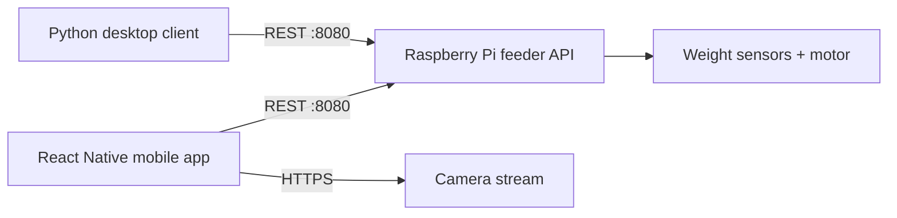

# PawStation

Desktop and mobile control clients for a Raspberry Pi smart pet feeder. PawStation connects to the feeder over a local REST API, presents live device telemetry, manages feeding settings, supports manual dispensing, visualizes history, and exposes the feeder's camera stream.

## What it does

- Saves the Raspberry Pi address locally
- Polls feeder status and clearly reports offline states
- Displays bowl weight, tank level, schedule, target amount, motor state, and device time
- Updates feeding time and portion size
- Prevents duplicate manual-feed requests while the motor is active
- Loads and visualizes daily feeding history
- Opens an embedded or external camera stream
- Provides both Windows desktop and React Native mobile experiences

## System architecture



This repository contains the client applications. It expects a compatible Raspberry Pi service that implements the API contract below.

## Clients

| Client | Best for | Stack |
| --- | --- | --- |
| Desktop | Development, debugging, and Windows laptop control | Python, CustomTkinter, Requests, Matplotlib |
| Mobile | Day-to-day phone control and camera access | Expo, React Native, AsyncStorage, WebView |

## API contract

| Method | Endpoint | Purpose |
| --- | --- | --- |
| `GET` | `/status` | Current weights, motor state, schedule, target amount, and device time |
| `GET` | `/daily` | Daily feeding-history entries |
| `POST` | `/settings` | Update `feed_hour`, `feed_min`, or `target_g` |
| `POST` | `/dispense` | Request a manual feeding cycle |

The clients connect to `http://<PI_IP>:8080`. The mobile app polls `/status` every three seconds while connected.

## Repository layout

```text
.
├── main.py                 # Desktop entry point
├── desktop_app.py          # Main desktop interface
├── api.py                  # Python REST client
├── chart.py                # Feeding-history visualization
├── config.py               # Local desktop settings
├── requirements.txt        # Desktop dependencies
└── mobile-app/
    ├── App.js              # Mobile dashboard and controls
    ├── src/api/            # Mobile REST client
    ├── src/components/     # Cards, chart, and video stream
    ├── src/hooks/          # Status polling
    └── src/storage.js      # AsyncStorage helpers
```

## Run the desktop client

```powershell
python -m venv .venv
.\.venv\Scripts\Activate.ps1
python -m pip install -r requirements.txt
python main.py
```

Enter the Raspberry Pi's local IP address in the application and connect.

## Run the mobile client

```bash
cd mobile-app
npm install
npx expo start
```

Open the project in Expo Go or an emulator. The phone and Raspberry Pi must be connected to the same trusted Wi-Fi network or hotspot.

## Network and camera configuration

- Feeder API: `http://<PI_IP>:8080`
- Default camera stream: `https://pawstation-cam.local/stream`
- Mobile local-network and cleartext HTTP access are enabled in the Expo configuration for development.
- If the embedded stream is unsupported, the app can open it in the device browser.

## Reliability behavior

- Requests use explicit timeouts and raise readable API errors.
- Both clients distinguish connected, reconnecting, and offline states.
- Manual feeding is disabled when the feeder reports `motor_on: true`.
- Mobile settings are validated before submission and stored between sessions.

## Production considerations

The current design targets a trusted local network. A deployed product should add authenticated API access, TLS with managed certificates, device discovery, retry backoff, secure credential storage, and end-to-end tests against the Raspberry Pi service.

